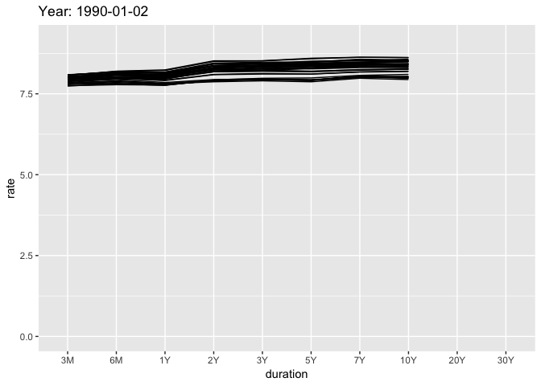

<!-- README.md is generated from README.Rmd. Please edit that file -->

# yieldr 

[](https://travis-ci.com/dylanjm/yieldr)
<!--  -->
[](http://www.repostatus.org/#active)
<!--  -->

## Installation

You can install yieldr from github with:

``` r
# install.packages("devtools")
devtools::install_github("dylanjm/yieldr")
```

## Basic Usage

As of right now, the package only comes with one function:
`get_treasury_yields()`.

``` r
library(yieldr)
library(dplyr)
library(gganimate)
library(ggplot2)

treasury_dat <- get_treasury_yields(tidy = TRUE)

treasury_dat %>% 
  mutate(duration = forcats::fct_relevel(duration, unique(treasury_dat$duration))) %>% 
  filter(!duration %in% c("BC_1MONTH", "BC_2MONTH", "BC_30YEARDISPLAY")) %>% 
  ggplot(aes(x = duration, y = rate, group = NEW_DATE)) + 
  geom_line() + 
  scale_x_discrete(labels = c("3M", "6M", "1Y", "2Y",
                              "3Y", "5Y", "7Y", "10Y", "20Y", "30Y",
                              "30YD")) + 
  labs(title = "Year: {frame_time}") +                             
  transition_time(NEW_DATE) 
```


